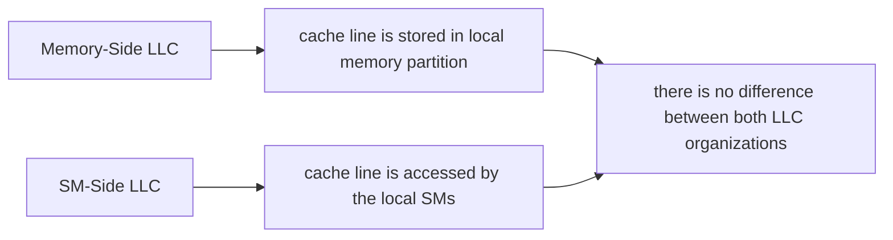

# 背景


## GPU扩展性能两种方式
- 增加SM数量
- 增加内存带宽
## 代价
- 面积增加
- 产量降低

## 多GPU架构分类
### multi-socket GPUs
	把很多GPU和内存放在同一块PCB上
		
- 通过内部互联总线进行通信
- 每个GPU都会连接到本地内存上
- 此时 **性能** 的差别主要体现在**带宽**上
- 成本低
- 内存容量高
- 带宽低

### MCM GPUs
	GPU和内存分别进行封装
- 高带宽
- 内存容量有限
- 成本高

## 挑战

克服芯片间和芯片内部**带宽**的不同

## 先前工作

### 在LLC上进行设计和改进

	local：对于GPU和caches是在同一块chip上，对于memory，连接gpu的部分
	remote ：对于GPU和caches是在不同的chip上，对于memory，连接在其他gpu的部分

#### 内存端
- 优点：最大化内存的利用率
- 缺点：如果访问的数据过于遥远，必须得经历带宽小的链路
#### SM端
- 优点：能够缓存远端的数据从而使得访存数据的时候带宽加大
- 缺点：内存利用率比较低，保持缓存一致
### 优化内存的带宽

### 优化LLC带宽
1. Milic等人提出动态LLC策略来优化和平衡从本地内存向外传输的带宽和芯片间传入数据的带宽
2. Arunkumar等人提出1.5级缓存的概念（本地存远端数据）作为一种对内存端LLC的补充，将本地静态的LLC容量分为，本地数据和远程数据

# 问题 and 思路
	有效带宽：在给定工作负载的访问模式的时，系统所提供的带宽
## 分析1

```ad-note
title: 性能分析
在执行SM-side preferred benchmarks的时候，SP的LLC miss rate是要比MP端大（平均性能提高了91%），但所平均表现却成相反关系。这很反知觉，这种现象往往发生在带宽增加能够削减高额的miss rate情况下，原因是访问远端数据时，SP端LLC下经过高带宽，而避免经过低带宽链路，链路延迟的缩小导致了性能的增加。但，对于 memory-side preferred benchmarks的时候，带宽的增加不能去削减高未命中率所带来的影响。所以MP比SP平均性能提高了32%
```
	
	
传统观念认为，GPU的性能影响是由于内存带宽引起的，但根据上述分析，可以看到LLC带宽对GPU性能的影响。


事实上，**workload通常会根据哪种类型的LLC带宽更大去选择SP和MP，而这取决于workload中芯片间数据共享的程度和性质**

1. 小的数据集，比如小的程序和cpu会偏向**SM-side**的组织形式，因为有足够多的LLC空间去复制其共享数据集
2. 大的数据集会更偏向**Memory-side**的组织形式，因为共享的数据集，因为LLC的空间不足以存放数据集 

无论是之前动态的还是静态的LLC都无法最大化LLC的有效带宽。本文提出了*Sharing-Aware Caching* (**SAC**)去最大化LLC的有效带宽。


## 问题
多GPU系统中性能最佳的LLC架构，是LLC有效带宽最大的架构。探究一种方案，使得LLC有效带宽能够最大

## 思路

SAC 通过改变 NOC 路由策略和增加简单的旁路和控制逻辑来实现对 SM-side 和 Memory-side 的选择。这种策略能够使得 NOC 的面积和功耗与内存端保持一致（crossbar保持不变），但是与 SM 端的架构相比，Noc 的功耗和面积分别减小了21%和18%。

由于cpu在开始的时候，会有一个小的profiling window使用硬件性能计数器去收集输入，而这足以让SAC决定在cpu接下来的执行中，是采用memory-side或者SM-side的组织方式


## 动机

### Memory-Side LLC

cache data:在本地和远端SMs中的本地内存的数据

### SM-Side LLC

cache data：本地内存数据和远端内存数据
NoC: 提供固定延迟和带宽优势（不如需要与SM和LLC之间通信抢占资源），但会有更大的面积和功耗（维持一致性协议）

### SAC

**key observation** : 对内存端LLC基本架构的**微小**更改就可以**同时支持**内存端和SM端LLC的策略

1. LLC旁路（增加旁路，选择逻辑和多路复用器）
2. 修改NoC的路由算法以路由远端请求到远端的内存端LLC和本地的SM端LLC
3. 改变 LLC 控制器以发送远端 LLC 未命中的消息到远端的内存端 LLC（同样，所有达到本地的 LLC 未命中都是以内存端 LLC 的组织结构形式）
4. 对提供SM端所需要的一致性操作（在软件一致性下，CPU的LLC刷新；在硬件一致性下，共享内存无效）

```ad-note
title: 一些名词解释
*false inter-chip sharing* ：不同chip上的SM访问相同内存页上不同cache line上
*true inter-chip sharing* : 不同chip上的SM访问相同的cache line
```

## 分析2

基本假设：双 gpu 芯片 C0 、C1，每个芯片上只有一个 LLC 以及使用**软件一致性**，连接着一块内存，内存法分配采用*first-touch page allocation policy*

### Non-shared cache lines




### Falsely shared cache lines

<font color=orange>Memory-Side LLC</font>: 会导致访问远端数据时候，重复访问所遍历过的芯片链路
<font color=orange>SM-Side LLC</font> : 避免了链路的重复遍历

SM 端的 LLC 更优，因为其将经常访问的数据缓存在 LLC 上来增大有效带宽

### Truly shared cache lines
<font color=orange>Memory-Side LLC</font>: 增加芯片间链路的负担
<font color=orange>SM-Side LLC</font> : 增加了芯片间的有效带宽，但是减小了 LLC 的容量，也需要一致性协议的支持

SM-Side LLC 在复制缓存行的优势比抵消 LLC 未命中率所增加的带宽开销大和有足够多的共享数据来抵消维持一致性协议的开销的时候有优势

Memory-Side LLC 年能够避免一致性的问题，并产生更高的 LLC 了利用率，但他并不会对共享缓存行展示出高的有效带宽

### LLC 组织形式对 L1 cache 的影响

如果真共享的数据超出 LLC 的容量，那么 SM-Side 组织形式下的数据复制可能会导致数据抖动


# 方法-SAC

## SAC 架构

### bypass path (wires)

```ad-note
title:职责
connect to memory controller and mux/demux。SM端，请求解复用到LLC或者bypass path；响应复用到NoC端口。内存端，响应解复用；请求复用
```
本地未命中和远端未命中共享一个请求队列。如果队列满了，就会强行让请求在本地 LLC 前等待

### 优点
不需要更改 crossbar 的结构，他只是增加了两个逻辑选择：
1. 将 SM 未命中从本地转发到 NoC
2. 当远端 SM 未命中的时候，经过 LLC


## Runtime Support
初始化：内存端 LLC
收集数据：性能计数器
输入：分析数据
分析模型：EAB (Effective Available Bandwidth)
分析窗口：2k个时钟周期
并不需要在运行的时候进行再分析
保证 CRD 看到数据地址映射到此内存分区的所有请求

## EAB model

```ad-note
title: explain
a model to compute the EAB under the memory-side and SM-side LLC organizations 
```

<center>EAB<sub>total</sub> = EAB<sub>local</sub> + EAB<sub>remote</sub></center>
<center></center>
本地和远端请求受到不同带宽限制的瓶颈，但其取决于特定的 LLC 配置

带宽计算取决于：
1. 他们是否处理本地或者远端请求
2. 特定 LLC 组织


## 收集输入

性能计数器：R<sub>local</sub>, LSU, LLC<sub>hit</sub> 
R<sub>local</sub>仅仅由程序决定
LSU, LLC<sub>hit</sub>不仅由程序决定，还有 LLC 在组织方式决定

### Counters
Total requests, local requests 用来计算 R<sub>local</sub>
slice requests 用来计算 LSU
CRD hits counters, CRD requests counters 去计算 SM 端的未命中率

### CRD
	可以在内存端配置下去预测SM端配置下的未命中率
CRD 采样 n 组本地缓存区，去记录在 SM 端配置下的任何芯片中该块是否会被访问和复制
每一个块都由一个 tag 位和四位的标志位（去记录是否被 chip i 访问到）。如果有分组，还要增加位去看到底是在哪组
# 实验

考虑请求队列满导致的等待
Cache 为 16 路 8 组相联，30-bit tag, 4 bits 记录请求

## baseline multi-chip GPU

组成：4个GPU芯片
GPU芯片：
- 64 SMs
- 128 KB private L1 caches,
- 4 MB LLC
- 8 memory controllers
- cache is conventional caches
- NoC:
	- inputs: 32 SM clusters(两个GPU共享一个网络节点) + 6 inter-chip links
	- outputs: 16 LLC slices + 6 inter-chip links
	- 二分带宽4TB/s
	- hierarchical crossbar(模拟集中式的crossbar，这种crossbar有着更大的面积和功耗)
- NVLink(作为inter-chip links)
	- 带宽：64 GB/s
- 环形网络：每对芯片之间有三条链路

DSENT：NoC 仿真
CACTI：内存/缓存仿真

四个内存分区 32个内存通道
第二代 NVLink 模拟链路带宽，GDDR6 模拟内存带宽
Cache配置：L1 写通，L2 写回


## 结论

SM-Side preferred benchmarks: 
1. 跨芯片复制相对较小的 turly shared working set 并不会对缓存容量造成压力，但同时显著提高这些缓存的有效带宽
2. 测试集更多的是 false-sharing working set

Memory-Side preferred benchmarks: 跨芯片复制这些 turly shared working set 会在较大的时间内超过 LLC 容量，这样的情况会更偏向内存端 LLC 组织

SAC 的优势源于工作负载的共享工作集

对于 SM-Side preferred benchmarks，当输入数据太大的时候，SAC 会选择 memory-Side 配置
对于 Memory-Side preferred benchmarks，当输入数据量小的时候，SAC 会选择 SM-Side 配置

SAC 相对内存端 LLC 的性能改进随着芯片间带宽的增加而减少：芯片间带宽越高，本地缓存远端数据和复制共享数据的重要性就越低

与内存端 LLC 相比，更大的 LLC 容量提高了 SAC 性能：更大的 LLC 可以在本地缓存更多的数据，并跨芯片复制更大的共享工作集

SAC 性能增长的比内存端 LLC 增长的更多：从 GDDR5 增加到 GDDR6 和 HBM2，系统瓶颈从内存带宽转移到芯片间网络。因此，复制共享数据集对于高内存带宽的系统更为重要，它可以提高 SAC 的性能优势

在 SAC 下，硬件一致性效果比软件一致性效果好

SAC 的性能会随着 GPU 个数的增加而增加：GPU 数量增加，每个 GPU 的带宽减少，增加 SAC 增加有效带宽的机会

Page size 并不是特别敏感。它只影响了 false sharing，而 ture sharing 才是 SAC 关键

# 相关工作
Page migration 通过将页面迁移到本地内存模块来提高 LLC 之后的带宽